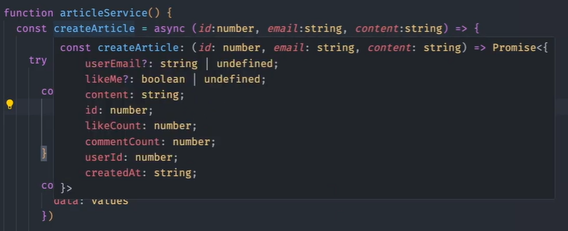
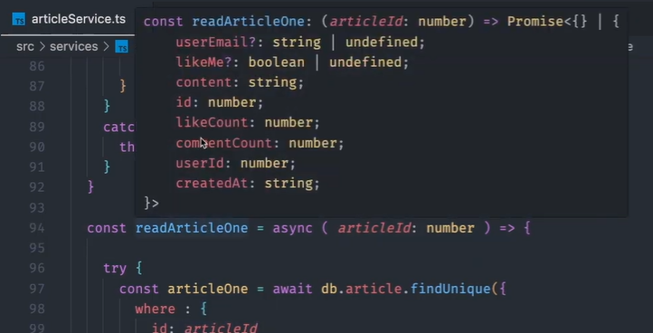
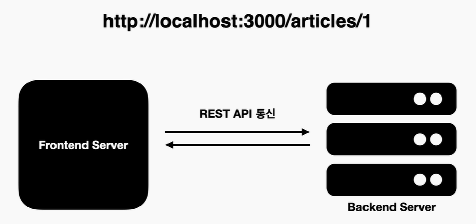
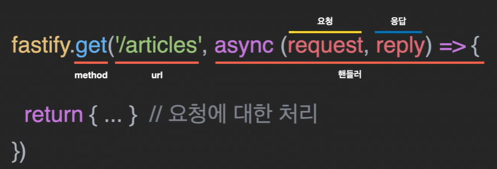
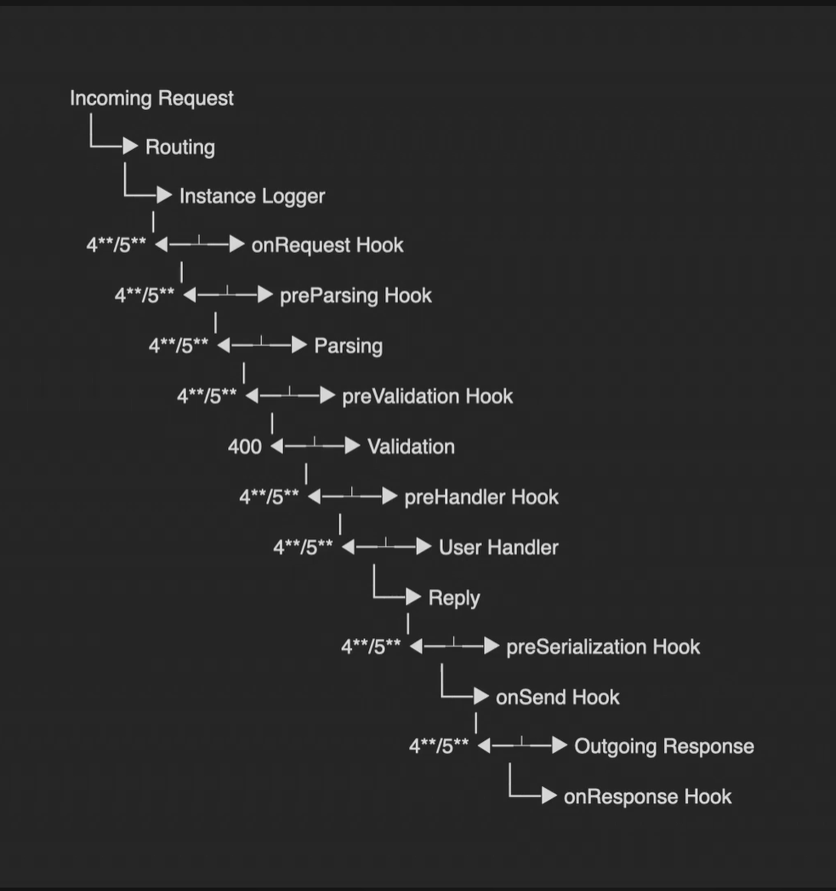
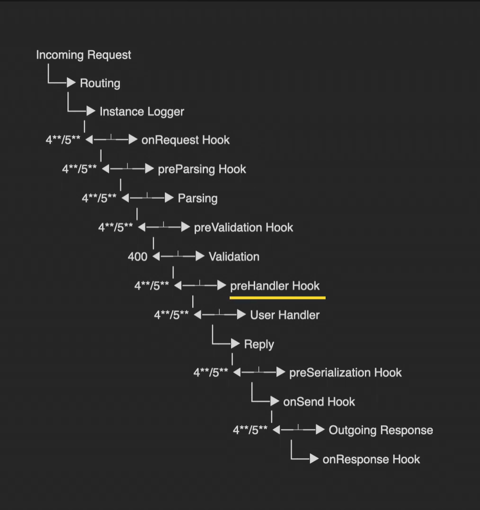
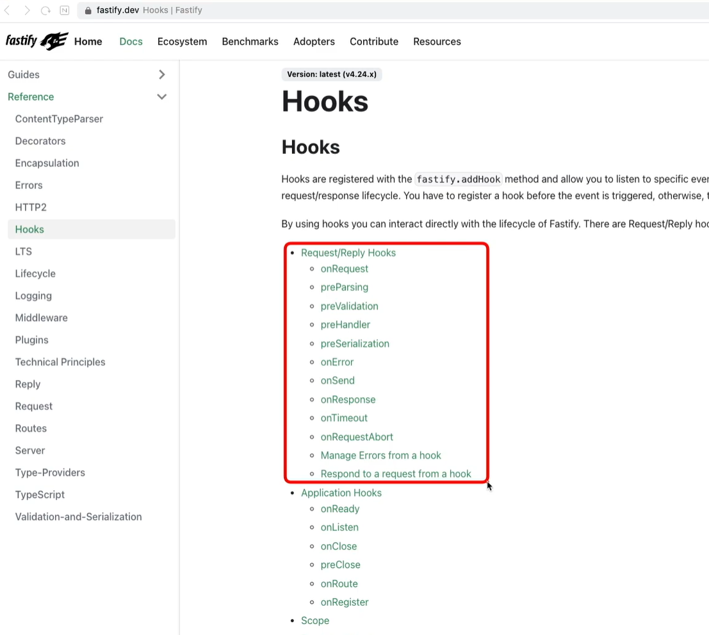
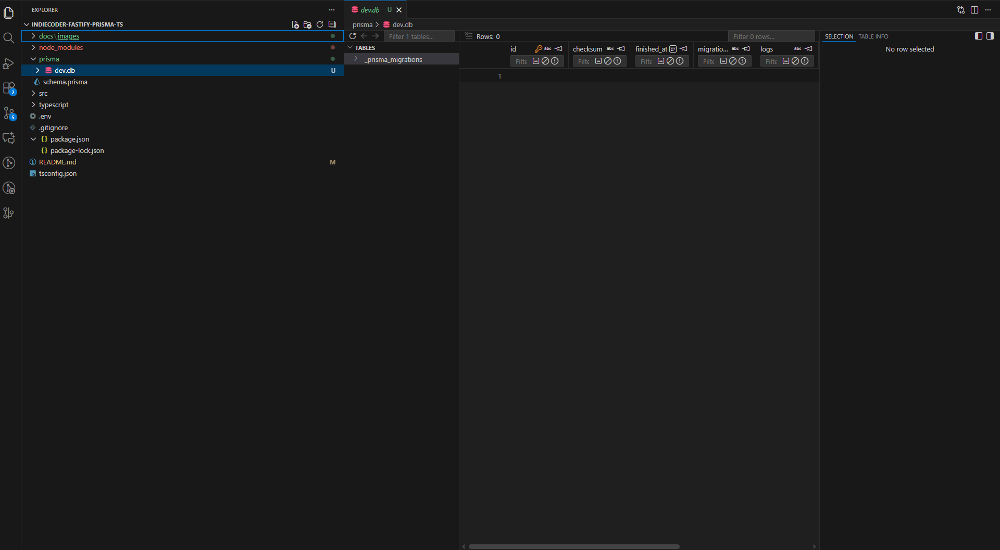

# Typescript기반 Fastify, Prisma 백엔드 프로젝트
<details>
<summary>접기/펼치기</summary>
<br>

## NodeJS 백엔드 프레임워크
- ExpressJS
- Fastify
- Hapi
- koa
- restify

### Fastify의 장점
- 대중적인 프레임워크인 ExpressJS 대비 빠른 응답처리 속도
- 벤치마크상 NodeJS 프레임워크중 상위권
- ExpressJS 대비 2배이상의 속도
- 기본적으로 최소한의 기능을 제공하는 가벼운 프레임워크
  - 기능 확장을 통해 다양한 플러그인 제공
  - 커스텀으로 플러그인을만들어 기능 추가 가능
- Promise 비동기 처리 가능
- 표준화 된 JSON 스키마를 이용하여 유효성검사 가능하도록 지원

### prisma
- 대중적으로 인기있는 다양한 DB를 지원하는 ORM
- 스키마를 이용하여 데이터베이스 테이블을 직접 관리할 수 있는 기능 제공
- 별다른 DB 툴 없이 개발환경에서 사용하는 IDE를 통해 DB 구조 설정 가능

### Typescript
기본적인 기능들은 자바스크립트와 같지만 자바스크립트에서 커버하지 못하는 기능을 추가한 확장팩에 가까운 언어이다.  
</details>
<br>

# TypeScript 기초 1 - Type과 Type정의
<details>
<summary>접기/펼치기</summary>
<br>

```js
let num1 = 10
let num2 = 20
console.log(num1 + num2) // 결과: 30
```
위 코드를 보면 num1과 num2는 모두 정수 형으로 인식이 되므로 로그로 출력시 결과값이 30으로 출력된다.  

```js
let num = 10
let text = '테스트'
console.log(num + text) // 결과: 10테스트
```
위 코드의 경우 text는 문자 타입으로 할당되어 실제 결과는 문자열 연산으로 적용되어 10테스트 라는 결과를 얻게 된다.  
위와 같이 자바스크립트는 타입을 특정하지 않아도 동적으로 타입이 지정되는 방식의 언어이다.   

## 타입 명시가 필요한 이유

- 자바스크립트 예제
  ```js
  function typeTest1(param) {
    Math.round(param)
  }

  typeTest('1')
  ```
  typeTest() 함수는 param이라는 매개변수를 갖고, 전달된 param은 숫자형 타입만 적용되는 Math.round()를 이용하여 반올림을 계산한다.  
  누군가가 testType() 함수 인자에 문자를 전달하여 호출할 경우 오류가 발생하게 된다.  
  문제는 해당 오류가 코드를 실행해야 발생한다는 것이다.

- 타입스크립트 예제
  ```ts
  function typeTest2(param: number) {
    Math.round(param)
  }
  typeTest2('1') 
  ```

반면, 타입스크립트는 매개변수 param을 number타입으로 지정할 수 있다.  
또한 함수 호출시 매개변수에 문자를 입력하여 호출할 경우 코드를 작성할 때 오류가 발생하게 된다.  
즉, 코드를 서버 등에 올리기 전에 개발 단계에서 바로 오류를 확인할 수 있게 된다.  

## 기본 타입(원자성)
- number  
  정수 타입
- string  
  문자열 타입
- boolean  
  true/false (참/거짓) 타입
- null  
  값이 비어있는 타입
- undefined  
  정의되지 않은 타입
- any  
  어떠한 타입이든 모든 값을 받을 수 있는 치트키와 같은 타입  
- never
  아무 값도 가질 수 없는 자주사용되지 않는 특별한 타입  
- void  
  함수에서 반환값 즉, 리턴이 필요 없을 때 사용하는 타입  
- object  
  객체형태의 타입이다.  

위 타입들은 더이상 쪼개질 수 없는 원자의 성격을 가지며, 아래와 같이 타입을 지정할 수 있다.  
```ts
let num: number
let str: string
let bool: boolean
let no: null
let anyValue: any
```

## Type의 조합(객체형태)
기본 타입과 같이 단순하게 타입을 지정하는 경우도 있으나, 이러한 기본 타입들을 조합하여 객체 형태로 좀더 복합적인 형태의 타입을 만들어 사용할 수 있다.

```ts
type Person = {
  name: string
  age: number
}
let kim: Person
```

`type Person = {}`과 같이 정의하고, 중괄호 안에 객체 형태의 타입이 갖는 속성들에 대한 세부 타입을 지정해준다.  
이후 변수뒤에 콜른을 이용하여 만들어진 타입을 지정하면 된다.  

## union
앞서 하나의 변수에 하나의 타입을 지정한것과 달리, 필요에 따라 여러 타입을 선택적으로 사용될 경우가 있다.  
이럴 때 사용하는 것이 바로 union이다.  

버티컬바 `|` 를 이용하여 두가지 이상의 타입을 표기하면 된다.
```ts
let test: number | string
```
위 예제의 경우 test변수는 number또는 string타입 중 하나에 해당하는 타입을 가질 수 있다.  

```ts
function fn(param: Student | Worker): void {}
```
위 예제의 경우 fn 함수의 매개변수 param과 같이 Student 혹은 Worker 타입 중 하나의 타입을 가지게 설정할 수 있다.  
즉, 단순 원자타입이 아닌 사용자가 정의한 타입 역시도 union을 이용하여 여러 타입 중 하나를 갖게할 수 있다.  

## interface
타입을 지정하는 방법 중에는 interface라는 것도 있다.  
```ts
interface Person {
  name: string
  age: number
}
```
사용방법은 위와같이 type키워드 대신 interface 키워드로 정의하면 된다.  
type과는 다르게 할당하는 기호 `=`을 사용하지 않는다.  

interface는 type과 비슷하지만 타입과 다르게 속성의 확장이 가능하다.  

### interface의 확장
```ts
interface Person {
  name: string
  age: number
}
interface Student extends Person {
  /* Person의 name, age 확장 */
  major: string
}
interface Worker extends Person {
  /* Person의 name, age 확장 */
  skill: string
}
```
위 예제와 같이 extends라는 키워드를 사용하여 확장할 수 있다.  
Person타입을 extends 함으로써 Student와 Worker타입 모두 name과 age를 기본으로 갖되,  
Student는 major, Worker는 skill을 추가로 받는 형태가 되는 것이다.  

#### 다중 확장
```ts
interface Programmer extends Worker, Student {}
```
참고로 extends는 하나의 타입이 아닌 여러 타입을 extends 해서 받아올 수 있다.  
위 예제의 경우 name, age, major, skill을 기본으로 갖게 된다.  

#### type과 함께 사용 가능
```ts
type Person = {
  name: string
  age: string
}
interface Student extends Person {
  /* Person의 name, age 확장 */
  major: string
}
interface Worker extends Person {
  /* Person의 name, age 확장 */
  skill: string
}
```
첫번째 예제와 동일하게 Person의 name, age를 기본으로 갖게 된다.  

## 함수에서의 Type
함수에서는 매개변수와 반환값을 타입으로 지정할 수 있다.  
```ts
function sum(num1: number, num2: number): number {
  return num1 + num2
}
```
위 예제를 보면 매개변수 num1과 num2를 각각 number타입으로 지정하고
함수 내부에서 num1과 num2를 연산하여 반환하므로 해당 타입인 number 타입을 지정했다.  

### void 반환 타입
```ts
function sum(num1: number, num2: number): void {
  console.log(num1 + num2)
}
```
위 예제와 같이 주로 console.log()와 같이 로그를 출력하거나, 다른 함수를 출력하는 경우 등 return 하지 않을 때 void 타입을 지정한다.  
</details>
<br>


# TypeScript 기초 2 - 제네릭과 타입가드
<details>
<summary>접기/펼치기</summary>
<br>

## Generics

### generic 함수
```ts
function logText(text: string | number) {
  console.log(text)
  return text
}

const num = logText(1)
const a = logText('a')

a.toUpperCase(); // 오류 발생
```
위 예제와 같이 함수의 특정 매개변수에 한개 이상의 타입이 올 수 있게 만들어야 하는 경우가 있다.  
이때 타입스크립트에서 제공하는 union을 이용할 수 있으나 union으로 지정할 경우 number 즉 숫자 타입을 선택하고 소문자를 대문자로 치환하는 toUpperCase()와 같은 문자형을 위한 기능을 사용한다면 오류가 발생한다.  
toUpperCase가 문자열에만 적용이 되는데 `string | number`와 같이 union 타입으로 지정할 경우 문자가 될 수도 있고 숫자가 될 수도 있어 정확한 타입 체크가 어렵기 때문이다.  
물론 이런 경우 필요에 따라 함수를 여러개 만드는 방법 도 있지만, 완벽한 정답이라고 보기엔 어렵다.  
이런 경우에 편리하게 사용할 수 있는 기능이 타입스크립트의 generic이다.

```ts
function 함수명<타입변수> (매개변수: 타입변수) : 반환타입 {}
```
위와같이 함수명 옆에 홑화살괄호를 활용하여 `<타입변수>` 형태로 타입 변수를 정의하면 된다.  
그리고 매개변수나 리턴 값을 지정한 타입변수로 이용하여 타입을 지정할 수 있다.  
즉, 타입을 함수의 매개변수처럼 적용해 설정할 수 있게 되는 것이다.  

제네릭 타입의 경우 호출이 필요한 타입으로 변경이 가능하다.  
```ts
function identiiy<T>(arg: T): T {
  return arg;
}
identity<string>('hi')
identity<number>(10)
identity<boolean>(true)
```
위 예제와 같이 identity 함수 호출 예를 보면 상황에 맞게 인자값에 해당하는 타입을 설정한 것을 볼 수 있다.  
첫 번째는 string 형태의 인자를, 두 번째는 정수를, 세 번째는 boolean타입을 설정하고 해당 타입에 맞는 인자를 넣어 호출하고 있다.  
참고로 예로 든 변수 T의 경우 단일문자를 사용해도 되지만 실제 사용할 때는 변수나 함수명처럼 구체적으로 사용하는 것이 좋다.  

generic을 이용하면 아래와 같이 함수를 호출할 때 타입을 지정할 수 있으므로 어떤 함수의 매개변수나 리턴값이 여러가지 타입을 가질 수 있을 때 사용하면 매우 유용하다.  
```ts
function logText<T>(text: T): T {
 console.log(text)
 return text;
}

const str = logText<string>('abc') // 타입을 string 으로 지정
str.toUpperCase() // 정상작동
```
#### Generic함수 - 배열
또 배열의 경우 아래와 같이 `T[]` 형태로 배열 기호를 사용하거나 `Array<T>` 형태처럼 Array를 직접 써서 표현할 수도 있다.  
```ts
function identity<T>(arg: T[]): T[] {
  return arg.length
}
function identity<T>(arg: Array<T>): Array<T> {
  return arg.length
}
```
참고로 이때 만약 length와 같은 배열에 이쓴 기능의 경우 generic에 배열을 표시하지 않으면 오류가 발생하게 된다.  

### interface에서의 Generic
또 인터페이스에서도 제네릭을 사용할 수 있다.  
```ts
interface GenericFn<T> {
  (arg: T): T
}
function identity<T>(arg: T): T {
  return arg
}
let myIdentity: GenericFn<number> = identity
myIdentity(15);
```
위 문법은 함수 시그니처를 인터페이스로 정의하는 문법이다.  
즉, 인터페이스를 활용하여 함수 자체의 타입(형태)를 정의한다.  
T를 받아 T를 반환하는 함수여야만 한다는 규칙을 정의하였다.  
즉, 여러 함수들이 동일한 규격(시그니처)를 따르게 하기 위함이다.  
이와같이 사용할 경우 함수의 타입을 재사용할 수 있게 된다.  


자바의 Functional Interface와 동일하다고 생각하면 된다.

#### 자바의 Funcitonal interface
```java
interface GenericFn<T> {
  T fn(T arg)
}

public class Function {
  public static <T> T identity(T arg) {
    return arg;
  }
}

GenericFn<Integer> myIdentity = Function::identity
myIdentity.fn(15);
```

### Promise
서버와 통신등에 쓰이는 Promise의 경우 generic이 기본적으로 사용된다.  
```ts
async function test<T>(arg: T): Promise<T> {
  await new Promise((resolve) => setTimeout(resolve, 1000))
  return arg;
}
```

generic은 특정 함수에서 매개변수나 리턴값이 상황에 따라 동적으로 타입이 달라지는 경우에 사용하면 상당히 유용하게 사용할 수 있다.  

## 타입 추론

[코드 레퍼런스](https://github.com/freeseamew/SLOG-FASTIFY-PRISMA-TS-STUDY/blob/master/src/services/articleService.ts)

  
createArticle의 경우 코드상으로는 리턴타입이 비어있으나 Promise 형태로 리턴 타입을 출력해준다.  
  
readArticleOne의 경우도 리턴 타입이 비어있으나, 실제로 메소드위에 마우스를 올릴경우 반환 타입을 출력해준다.  
즉, 코드상으로 표현되는 타입이 명확하다면 타입을 지정하지 않아도 타입스크립트가 타입을 추론해 낸다.  
타입 추론은 상당히 강력한 기능이다.  
이렇게 추론이 가능한 코드에서는 명시적으로 타입을 지정하지 않아도 된다는 것을 의미하고, 잘만 사용한다면 개발의 효율성을 높일수가 있다.  

## 타입가드
타입 가드는 말 그대로 원하지 않는 타입에 의한 어떤 오류가 발생하지 않게 하는 기능이다.  
```ts
function testGuard(value: number | string) {
  value.toFixed() // 오류
}
testGuard('일')
```
매개변수가 number 또는 string인 경우 즉, 멀티(유니온)타입일 경우로 예를 들어 본다.  
함수 내부에서는 전달받은 value를 반올림하는 toFixed()를 실행하게 된다.  
만약 문자타입의 값을 전달하여 함수를 호출할 경우 코드상의 오류가 발생하게 된다.  
이유는 숫자형 타입만 toFixed()로 반올림이 가능하기 때문이다.  

```ts
function testGuard(value: number | string) {
  if (typeof value = 'number') {
    value.toFixed()
  }
}
testGuard('일')
```
위와같이 if와 typeof를 이용하여 사용되는 값이 특정 타입일 때만 어떤 기능이 실행되도록 조건 코드를 작성해야한다.  
```ts
type Dog = {
  name: string
  color: string
}
function testGuard(value: Dog) {
  if ('color' in value) {
    console.log(`color는 ${value.color} 입니다.`)
  }
}
```
위 예제와 같이 Dog 이라는 직접 정의한 타입에서 특정 타입 확인이 필요할 경우 in을 사용해서 어떤 속성이 있는지 확인할 수도 있다.  
value에 color타입이 있는지 체크한다.  
타입 가드의 경우 정확하게 지켜지지 않는다면 오류가 출력되기 때문에 매개변수로 사용되는 어떤 값 등이 가변적일 때에는 타입 가드를 신경써야 한다.  

</details>
<br>

# Rest API
<details>
<summary>접기/펼치기</summary>
<br>

웹 개발에서 제일 많이 사용되는 통신 방법이다.  

URL 주소를 통해 요청을 하고 서버로부터 응답을 받게되는 구조를 갖는다.  
또한 URL 주소와 함께 아래 가지 핵심 메소드를 이용하여 요청을 하게 된다.

## 통신 메소드
- get: 데이터 호출
- post: 데이터 삽입
- put: 데이터 수정
- delete: 데이터 삭제

예를들어 아래와 같이 3000번 포트를 가지는 서버가 있다고 가정해본다.  
- 인증: localhost:3000/auth
- 게시글: localhost:3000/articles
- 좋아요: localhost:3000/likes
- 코멘트: localhost:3000/comments

article과 같은 정보를 보내 필요한 요청을 하게 되고 또 요청을 할때는 앞서 설명한 메소드를 사용하여 정보를 주고 받는다고 가정해본다.
- localhost:3000/articles
  - 조회: get
  - 입력: post
  - 수정: put
  - 삭제: delete

### `localhost:3000/articles`의 `GET` 요청 결과 예
아래와 같이 JSON 형태의 데이터를 받을 수 있으며, 해당 데이터를 바탕으로 frontend나 다양한 서비스를 확장해서 만들 수 있게 된다.  
```json
{
  "totalPageCount": 5,
  "articleList": [
    {
      "id": 50,
      "content": "content_50",
      "likeCount": 0,
      "commentCount": 0,
      "userId": 1,
      "userEmail": "user1@email.com",
      "likeMe": false,
      "createdAt": "Sun Sep 17 2023 17:31:14 GMT+0900 (대한민국 표준시)"
    },
    /* 생략 */
  ]
}
```

### URL Paramenter
요청에 필요한 어떤 값을 서버에 전달할 때 가장 기본적인 방법으로 URL에 특정 구역에 해당하는 값을 설정해서 서버로 전달하는 방법이다.  
`주소/articles/{articleId}` → `localhost:8083/articles/11`
위와같이 아이디 등의 데이터를 URL에 위치시킨 후 서버로 전달할 수 있다.  
위 방법을 **Path Variable**이라고 부른다.  

비슷한 방법으로 **Query String**도 있다.  
`주소/articles?pageNumber=1&mode=ALL` → `localhost:8083/articles?pageNumber=1&mode=ALL`  

위와 같이 물음표 다음에 필요한 값들을 넣어주면 되고 여러개의 값을 넘겨야 한다면 &(앤드) 기호를 통해 값들을 구분하여 다양한 여러개의 값들을 서버로 전달할 수 있다.  

또한 http 프로토콜에서 제공하는 헤더(Http Header) 등을 통해 토큰정보 등을 넣어 보낼수도 있고, 입력 폼 값 등의 경우에도 역시 바디(Http Body) 영역에 값을 실어 전달할 수 있다.  

</details>
<br>


# Fastify 기본 사용방법
<details>
<summary>접기/펼치기</summary>
<br>

Fastify의 주요 기능을 요약하면 아래 3가지로 요약할 수 있다.  
- Route: URL 정보를 바탕으로 요청 처리
- Hook: 요청에 따른 이벤트 발생 제어
- Plugin: 다양한 기능을 만들고 조립해서 사용하게 하는 기능

## Route
RestAPI에는 URL 주소와 메소드의 조합이 기본이다.  
이러한 URL로 전달되는 요청에 서버가 대응할 수 있게 해주는 Route는 Fastify 프레임워크의 가장 핵심적인 역할을 한다.  

### 구조

fastify 객체로 부터 Http 통신 메소드의 이름과 동일한 메소드를 호출한다.  
메소드 첫번째 매개변수로 요청 url을, 두번째 매개변수로 요청에대한 처리를 하는 콜백 핸들러 함수를 전달한다.  
핸들러 함수에는 요청에 대한 다양한 정보가 들어있는 request객체와 회신에 대한 옵션들을 받는 reply 객체를 매개변수로 받게된다.  

#### Request
- Body
- QueryString
- Params
- Headers
- 사용자 정의 값

#### Reply
요청에 내용에 따른 특정 결과를 처리하는 데필요한 요소들을 호출할 수 있다.  
- status
- send
- setCookie

### 메소드 사용 방식
```ts
fastify.get(path, [options], handler)
fastify.post(path, [options], handler)
fastify.put(path, [options], handler)
fastify.delete(path, [options], handler)
```
기본적인 사용 방식은 get과 동일하고 handler 처리 과정만 조금 다르다.  

### 그외 메소드
```ts
fastify.head(path, [options], handler)
fastify.options(path, [options], handler)
fastify.patch(path, [options], handler)
```
위와같은 메소드도 추가로 제공해준다.  

get부터 patch까지 7개의 라우터 정의 방식은 간단하게 사용하기 좋은 라우트 정의 방식으로 Shorthand Declaration 이라고 부른다.  

#### 라우트 세부 정의
```ts
fastify.route(option)
```
위와같이 fastify로부터 기존 메소드를 바로 사용하지 않고 route 메소드를 호출하여 안에 필요한 기능을 명시적으로 작성한다.  
기능의 설정은 기존과 달리 객체 형태의 옵션과 내용을 설정해서 사용하면 된다.  

**option**
```js
{
  method: 'GET',
  url: '/',
  schema: {/* ... */},
  preHandler: function (request, reply) {
    reply.send({hello:'world'})
  },
  handler: function (request, reply) {
    reply.send({hello:'world'})
  }
}
```
method 에는 get, put, post 등의 메소드를 설정하는데, 이때 중요한 것은 메소드를 대문자로 설정해야 한다.  
url은 말 그대로 요청 주소를 나타내고, 유효성 검사를 진행하는 schema를 배치할 수 있으며, preHandler와 handler라는 함수 형태의 훅도 정의한다.  
이와같이 명시적으로 라우트를 정의하는것은 각 항목의 이름을 직접적으로 사용하는 것 말고는 실제 기능적 차이는 없다.  

```js
fastify.route({
  method: 'GET',
  url: '/',
  schema: {/* ... */},
  preHandler: function (request, reply) {
    reply.send({hello:'world'})
  },
  handler: function (request, reply) {
    reply.send({hello:'world'})
  }
})
```

### schema
라우터에서 URL과 handler처럼 필수적으로 배치되는 요소 외에 Schema라는 요소도 있다.  
JSON 형태로 정의되어 있는 JSON Schema라는 방식으로 사용되며 요청과 응답 시에 주고받는 데이터의 형태를 정의하고, 정의된 데이터의 유효성을 검사하는 역할을 한다.  
```js
const articleSchema = {
  schema: {
    headers: {
      type: 'object',
      properties: {
        authorization: { type: 'string' }
      },
      required: ['authorization'],
    },
    response: {
      200: {
        type: 'object',
        properties: {
          hello: { type: 'string' }
        }
      }
    }
  }
}
fastify.get('article', articleSchema, asnync (request, reply) => ({hello: 'world'}))
```
위 예제에서는 headers와 resposne에 대한 유효성 검사를 수행한다.  
먼저 headers의 type은 object이고, 해당 object의 properties로는 authorization 이라는 필드가 있는데, 해당 필드는 string 타입이다.  
required에 authorization이 포함되어 있으므로, 요청시 꼭 전달되어야 하는 값이라는 것을 의미한다.  
(비슷한 방법으로 request의 또다른 요소인 Body, QueryString, Params에 대한 값도 체크할 수 있다.)  

headers 다음 요소인 response를 통해 client에 전달되는 데이터 형태등의 정의를 내릴 수 있다.  
예제에서는 200 즉, 성공적으로 응답이 처리되었을 경우 client로 보내질 데이터가 정의되어 있다.  
이러한 JSON Schema를 통해 응답 요청시 발생하는 다양한 데이터의 데이터 타입 및 필수 사항 등에 대해 유효성 검사를 할 수 있게 되는 것이다.  
이렇게 작성된 JSON Schema는 Router에서 URL 다음에 정의한 스키마를 배치해 (두번째 파라미터) 적용하면 된다.  
JSON Schema의 사용은 옵션 사항으로 필수적으로 입력해야 하는 내용은 아니지만 되도록이면 사용하는 것을 권장한다.  
JSON Schema를 이용하면 필수로 전달받아야 하거나 전달해야 하는 데이터의 형태를 정의할 수 있어 데이터 부제나 형태의 오류 등으로 발생할 수 있는 문제를 사전에 막을 수 있기 때문이다.  

### Typescript 적용
가장 큰 차이점은 Handler 매개변수로 사용되는 request와 reply의 사용법이다.  
```ts
fastify.post('/articles', async (request, reply) => {
  const { title, content } = request.body
})
```
request의 경우 위 코드와 같이 body 혹은 headers, params로 부터 값을 전달받을 수 있다.  
타입이 없는 자바스크립트에서는 위와같은 방식으로 전달되는 값을 사용할 수 있으나, 타입스크립트의 경우는 조금 다른 과정이 필요하다.  
위 코드에서 title과 content는 body에 속한 임의의 타입이지만 body에 대한 타입 속성이 정의되어 있지 않아 값을 받아올 수가 없다.  
그래서 이런 값들의 타입을 주입하는 과정이 필요하다.  

좀더 쉽게 설명하자면, 자바스크립트에서는 구조를 몰라도 실행이 가능하지만, 타입스크립트에서는 이러한 값들의 타입이 정의도어 있어야만 프로퍼티에 안전하게 접근할 수 있다.  

```ts
type TBody {
  title: string;
  content: string;
}
fastify.post<{Body: TBody}>('/articles', async (request, reply) => {
  const { title, content } = request.body
})
```
위 코드와 같이 받아지는 값들에 대해 generic을 타입 또는 인터페이스로 정의하고 타입 기초에서 학습했던 제네릭을 이용해 해당 타입을 주입해야 한다.  
이렇게 사용할 값들에 대해 타입을 정의해야만 핸들러에서 값을 사용할 때 오류가 발생하지 않는다.

여기서 제네릭 홑화살표괄호 안에 명시적으로 정의한 타입 방식은 그 자리에서 바로 넣는 인라인 타입 방식이다.
```ts
type TBody {
  title: string;
  content: string;
}
type BodyType {
  Body: TBody;
}
fastify.post<BodyType>('/articles', async (request, reply) => {
  const { title, content } = request.body
})
```

아래 코드와 같이 라우터를 명시적으로 사용할 경우도 마찬가지이다.
```ts
type TBody {
  title: string;
  content: string;
}

fastify.route<{Body: TBody}>({
  method: 'POST',
  url: '/',
  handler: function (request, reply) {
    const { title, content } = request.body
  }
})
```

handler에서도 직접 타입스크립트를 주입할 수 있다.  
이 경우 fastify에 정의된 FastifyRequest, FastifyReply를 import하여 사용할 handler 내에서 request와 reply 각각에 지정해준다.  
이때 FastifyRequest에 Generic으로 필요한 타입을 주입하면 된다.  
```ts
import Fasitfy, { FastifyRequest, FastifyReply } from "fastify";

const fastify = Fasitfy()

type TBody {
  title: string;
  content: string;
}

fastify.post('/', async (request: FastifyRequest<{ Body: TBody }>, reply: FastifyReply) => {
  const { title, content } = request.body
})

fastify.route<{Body: TBody}>({
  method: 'POST',
  url: '/',
  handler: function (
    request: FastifyRequest<{ Body: TBody }>, reply: FastifyReply) {
    const { title, content } = request.body
  }
})
```
위와같은 패턴은 핸들러의 코드를 분리할 경우 매우 유용한 패턴이기도 하다.  


Fastify의 Route를 이용해 요청과 응답을 주고받을 수 있기 때문에 백엔드 서버를 만드는데 있어서 가장 핵심이 되는 기능이다.  
Router를 작성하는데 있어 method schema handler 등의 기능들과 이들을 배치하는 방법.  
그리고 Route를 정의하는 방법에서 Shorcut 방식과 명시적 방식 두가지 방식이 있다는것,
마지막으로 타입스크립트를 이용할때 차이점에 대해 설명했다.  

</details>
<br>

# Fastify Hook
<details>
<summary>접기/펼치기</summary>
<br>

훅을 이해하기 위해서는 먼저 Fastify에서 다양한 이벤트에 생명주기를 이해할 필요가 있다.  

Fastify에서 어떤 요청이 들어오면 아래와 같은 순서로 처리가 된다.  
  

어딘가로 부터 서버에 요청이 들어오고, 그 요청을 처리하는데 필요한 과정이 생명주기이다.  
훅은 바로 이렇게 처리되는 과정에서 특정 순서 전에 사용자가 임의로 작성한 어떠한 이벤트를 처리해야할 때 사용하는 기능이다.   

이중 대표적인 훅은 preHandler 훅이다.  
  
handler는 router에서 설명했듯 요청에 대한 처리를 하는 곳이다.  
handler가 작동하기 전 먼저 수행해야 하는 과정이 있다면 preHandler에서 훅에서 그것을 처리하고 preHandler로 넘어가게 된다.  
이와같이 이벤트 처리 순서 전 사용자가 따로 개입하는 것을 훅이라고 한다.  
훅을 사용하는 가장 기본적인 방법은 route를 사용했던 것과 비슷하다.  
```ts
fastify.addHook('onRequest', (request, reply, done) => {
  // Some Code
  done();
})
```
fastify 객체로 부터 addHook 메소드를 호출하고, 첫번째 매개변수로 사용할 훅의 종류를, 두번째 매개변수로 콜백 함수형태로 필요한 로직을 처리한다.  
콜백 함수의 매개변수로는 request, reply, done을 가지게 된다.  
위 예제와 같이 addHook을 이용하여 작성할 경우 Route에서 Request가 발생하기 전 해당훅을 이용한 처리를 먼저 하게 된다.  

또 다른 사용 방법으로 라우트에서 필요한 설정 방법이 있다.  
```ts
fastify.route({
  method: 'GET',
  url: '/',
  schema: {/* ... */},
  preHandler: function (request, reply, done) {
    reply.send({hello:'world'})
  },
  onRequest: function (request, reply, done) {
  },
  preValidation: function (request, reply, done) {
  },
  onError: function (request, reply, done) {
  },
  handler: function (request, reply, done) {
    reply.send({hello:'world'})
  }
})
```
위와같이 handler 메소드 전에 정의하여 사용하면 된다.  
두가지 방식의 차이점으로는 addHook의 경우 작성된 라우트의 종류에 상관 없이 모든 라우트에 해당 훅을 적용하게 되지만, 라우트안에 위와같이 명시적으로 훅을 정의하여 사용하게 되면 해당 요청에만 특정 훅을 작동시킬 수 있는 차이가 있다.  

## Hook의 종류

### Request/Reply Hook
Fastify에서 가장 핵심이 되는 요청/응답 Hook이다.  
서버에 대한 요청이 일어나고 최종적으로 처리된 결과가 요청자에게 전달되는 라이프사이클 도중 발생되는 훅이다.  
  
[Fastify 공식 문서](https://fastify.dev/docs/latest/Reference/Hooks/)에 Hook에 대한 종류를 확인할 수 있다.  
이름을 보면 대략 어떤 기능을 하는 지 유추할 수 있다.  
onError의 경우 에러가 발생했을 때, preHandler의 경우 요청이 발생하기 전 사용자의 권한 등을 체크할 때 많이 사용된다.  

### Application Hook
라우터에서 발생하는 요청/응답 이 아닌 해당 서버 자체에 대한 훅이 되겠다.  

예를 들어 onReady와 onClose의 경우 서버의 시작과 종료 전 어떤 처리가 필요할 수 있다.  
```ts
fastify.addHook('onReady', function (done) {
  // Some Code
  const err = null;
  done(err);
})
fastify.addHook('onClose', async function () {
  // Some async code
  await loadCacheFromDatabase()
})
```
다만 사용 방법의 경우 addHook을 이용한 방법만이 가능하다.  
(요청 응답이 아닌 서버 자체 훅이기 때문)

훅을 적절히 이용하게 되면 요청이 발생했을 때 필요한 처리를 매우 효율적으 관리할 수 있다.  

</details>
<br>


# Fastify Plugin
<details>
<summary>접기/펼치기</summary>
<br>

Fastify의 기능 확장에 사용된다.  
기본적으로 거대해진 라우트를 주제별로 나누어 배치할 때 사용된다.  
또 Fastify에서 제공하지 않는 특정 기능을 Plugin으로 만들어 사용할 수도 있다.  

```ts
import {FastifyInstance, FastifyRequest, FastifyReply} from 'fastify'

const articleRoute = async (fastify: FastifyInstance) => {
  fastify.post('register', /* ,,, */)
  fastify.get('users', /* ,,, */)
}
export default articleRoute
```
위와 같이 특정 주제의 route 함수를 만들고 이를 export 시키면 된다.  
이때 매개변수로 fastify를 사용하는데, 타입스크립트의 경우 fastify 패키지로부터 FastifyInstance 타입을 가져와 배치하면 된다.  

이와같이 주제별로 만들어진 라우터들은 레지스터를 이용하여 모아지고 등록하여 사용할 수 있다.  
```ts
import Fasitfy from "fastify";
import pluginName from 'pluginName'

const fastify = Fasitfy()
fastify.register(pluginName, [options])
```
위와같이 만들어진 플러그인을 import로 불러온 후 fastify의 register를 호출하여 plugin을 등록하고 option을 설정하면 된다.  

register를 이용하여 작성된 라우터를 등록하는 방법은 다음과 같다.  
```ts
import Fasitfy {FastifyInstance} from "fastify";
import authRoute from './auth'
import articleRoute from './article'

const fastify = Fasitfy()
const route = async (fastify: FastifyInstance) => {
  await fastify.register(authRoute, {prefix: '/auth'})
  await fastify.register(articleRoute, {prefix: '/articles'})
}
fastify.register(route)
```
작성된 router들을 import하고, route 함수를 작성한 다음, 해당 함수 안에 fastify의 register를 이용하여 불러온 라우터를 배치하면 된다.  
이때 중요한 옵션으로 prefix라는 것이 있는데, prefix를 통해 호출할 하위 url을 등록할 수 있다.  
예를들어 메인 url 다음으로 /auth url을 호출하면 authRoute 내용을 호출할 수 있고, /articles url을 호출하면 articleRoute를 호출할 수 있다.  
이렇게 만든 메인 route는 최종적으로 fastify의 register에 등록한다.  

## 사용자 정의 Plugin 
플러그인은 Route를 분할하는 역할 말고도 Fastify의 개발자가 원하는 기능을 추가로 만들어 사용하는 역할도 한다.  
이를 위해서는 우선, fastify-plugin 패키지를 설치하여 사용하는 것을 권장하고 있다.  

```bash
npm i fastify-plugin
```

```ts
import fp from 'fastify-plugin'

function customPlugin() {
  fastify.decorate('name', null)
  /* ... */
}

export const customPluginName = fp(customPlugin, {
  name: 'customPluginName'
})
/* ... */

fastify.register(customPluginName)
```
설치한 fastify-plugin으로 부터 fp 패키지를 import한다.  
plugin은 일반적힌 함수 형태로 정의하여 사용하며, 일반적으로 많이 사용하게 되는 기능은 fastify의 decorate 이다.  
decorate의 역할은 해당 플러그인을 사용하게 될 때 필요한 객체들을 등록하는 역할을 한다.  

다음으로 작성된 plugin을 fastify-plugin에 등록하기 위해서는 import한 fp를 호출하여 첫번째 매개변수로 전달한다.  
이때 플러그인 이름을 따로 등록하는 것도 가능하다.  

마지막으로 fastify-plugin에 등록한 플러그인 객체를 fastify의 register에 등록해준다.  

### 정리
plugin은 fastify의 핵심기능에 route를 주제별로 분류해서 작성하게 도와주고 또 패스티파이에 기본적으로 탑재되지 않는 기능들을 쉽게 확장할 수 있도록 도와주는 역할을 하게 된다.  

</details>
<br>

# Prisma
<details>
<summary>접기/펼치기</summary>
<br>

DataBase를 조회하는 SQL문을 조금 더 편리하게 개발할 수 있도록 도와주는 ORM의 하나이다.  
Prisma는 기본적으로 NodeJS가 설치된 환경에서 패키지를 설치하여 사용할 수 있다.  
강의에서 사용하는 Prisma의 버전은 5.6 버전이다.  
```bash
npm i -D prisma@5.6.0
```

## SQLITE
아주 가벼운 RDB로, 가벼운 프로젝트나 실습 용도로 사용할 수 있는 RDB이다.
일반적인 RDB와 다르게 환경설치 없이 이미지파일 하나만으로 RDB의 일반적인 기능들을 사용할 수 있다.  

npx를 활용하여 Prisma가 SQLITE를 사용할 수 있는 환경을 설정한다.  
```
npx prisma init --datasource-provider sqlite
```

설치가 완료되면 아래 사진과 같이 `.env`파일과 `schema.prisma`라는 파일이 구성된 prisma라는 폴더가 생성이 된다.  


schema.prisma 파일에 실제 DB 구조를 정의하는 Schema 등을 작성하여 Database의 테이블 등을 생성하거나 수정할 수 있다.  
```.prisma
generator client {
  provider = "prisma-client-js"
}
generator db {
  provider = "sqilite"
  url = env("DATABASE_URL")
}
```
위 코드는 schema.prisam 파일에 DataBase와 기본 연결 정보가 설정된 내용이다.  
코드상의 url 속성은 DB 경로가 된다.  
env 함수를 통해 DB 경로를 불러오는데, 이때 해당 정보는 prisma 폴더 하위에 .env 파일 설정되어 해당 정보를 불러오는 것이다.  

SQLITE는 파일로 DB가 생성되며 prisma 폴더에 생성된다.

### DB Schema 정의
Prisma가 다른 ORM과 차별화 된 특징 중 하나는 Prisma를 이용해서 DB 구조 즉, 테이블 등을 직접 관리할 수 있다.  
Prisma를 이용하면 DB 관리 툴을 사용하지 않고도 Prisma 만을 가지고 DB 테이블 구조를 생성/수정/삭제 할 수 있다
DB 테이블 구조는 Schema라고 불리는 것을 작성하여 이를 바탕으로 구성된다.  

#### 기본 작성 방법
```.prisma
model 테이블 이름 {
  컬럼이름 타입
}
```
위와 같이 model 키워드를 사용하여 테이블 이름 작성 후 중괄호 블록 내 컬럼 이름과 타입 형식으로 내용을 작성하면 된다.  
- prisma/schema.prisma
  ```.prisma
  model Post{
    id        Int
    title     String
    content   String
    published Boolean
    authorId  Int
  }
  model User{
    id        Int
    email     String
    name      String
  }
  ```
#### 추가 제약사항 설정
- prisma/schema.prisma
  ```.prisma
  model Post{
    id        Int     @id @default(autoincrement())
    title     String
    content   String?
    published Boolean @default(false)
    authorId  Int
  }
  model User{
    id        Int     @id @default(autoincrement())
    email     String  @unique
    name      String?
  }
  ```
  식별 값일 경우 @id 키워드를 작성하고, 단순 고유값일 경우 @unique, 그리고 @default(autoincrement())로 자동 증가값 설정을 한다.  
  @default(autoincrement())를 설정함으로써 값이 증가되는 형태로 중복없이 데이터 로우가 추가되게 된다.  
  @unique는 중복되지 않는 고유 값들만 넣는 옵션이다.  
  Post의 content 혹은 User의 name 타입 우측에 ?가 붙어있는데, null을 허용하는 옵션이다.  

#### 테이블간 관게 설정
- prisma/schema.prisma
  ```.prisma
  model Post{
    id        Int     @id @default(autoincrement())
    title     String
    content   String?
    published Boolean @default(false)
    author    User?   @relation(fields: [authorId], references: [id])
    authorId  Int
  }
  model User{
    id        Int     @id @default(autoincrement())
    email     String  @unique
    name      String?
    Posts Post[]
  }
  ```
  Post에서 User를 참조해야 하는 경우 Post에 특정 컬럼(author)를 추가하고 컬럼 옆 타입에 User을 지정한다.  
  타입 지정시 User가 없을수도 있기 때문에 ? 키워드를 붙힌다.  
  바로 이어서 @relation옵션을 통해 User의 id를 참조하는 authorId 컬럼을 fk로 지정해준다.
  fields 속성은 실제로 사용될 fk 컬럼이름, references 속성은 대상 테이블에서 참조할 컬럼으로 설정한다.  

  해당 관계는 ORM 관점에서 1개의 User는 여러개의 Post를 가질 수 있도록 양방향 관계이다.  
  ORM에서는 관계의 주인이 FK를 갖게된다.  

  DB 관점의 1:N 관계는 한명의 User는 여러개의 Post를 작성할수 있다.  
  이때 Post가 어느 User의 소속인지에 대한 정보(FK)를 가져야만 1:N 관계가 성립된다.
  User는 어떤 Post를 가지고 있는지에 대한 정보를 가지지 않는다.
  해당 정보는 User를 조회할 때 join을 통해 User의 userid와 Post의 fk와 일치하는 조건의 Post를 함께 가져온다.  
  이렇게 되면 같은 user지만 다른 post를 갖는 동일한 user의 정보가 중복으로 조회된다.  

  ORM 관점에서는 관계의 주인이 FK를 갖게 되는데, 관계의 주인은 Post가 된다.  
  그 이유는 DB 관점에서 봤을 때 Post가 실제로 User와의 연관관계를 정의하고 관리하는 책임을 가지기 때문이다.   
  어떤 User(FK)에 속하는지 결정하고 변경할 수 있는 위치에 있는 쪽이 Post이므로, 관계의 주인은 FK를 가진 Post가 된다.  
  이때 하나의 User는 여러개의 Post를 갖게 되므로, N인 Post가 FK를 갖게 되었다.  
  이렇게 1:N 관계에서는 소속을 결정하고 변경할 수 있는 테이블이 N이 되며,   
  같은 이유(소속을 결정할 수 있는 테이블이 N이 된다)에 의해 일반적으로 N이 FK를 갖게 된다.  

  ORM 관점에서 1:N으로 표현하지 않고 관계의 주인이라는 측면에서 N을 주인으로 보고 Many To One(N:1) 관계로 표현한다.  

  위 코드는 Many To One 양방향 관계이다.  
  User가 여러개의 Post를 갖는 Posts라는 컬럼을 갖게 되는데, 실제 DB 관점에서는 해당 값을 갖지 않지만, 
  Post를 통해 원하는 User에 대한 동일한 Post를 조회하는것 보다, User 기준으로 Post 값을 조회하는것이 보다 효율적이다.
  그러나, 단방향으로 설정할 경우 User에는 Post에 대한 정보를 얻을 수 없기 때문에 객체간 패러다임 불일치가 발생한다.  

  따라서 양방향을 설정하는 이유는, User 객체를 기준으로 직접 Post 목록을 탐색하 수 있도록 하여 객체 지향적으로 모델링하고,  
  조회 시에도 Post를 역방향으로 찾기 위한 불피요한 쿼리 조합이나 조건 계산 없이 User.Posts를 통해 즉시 접근할 수 있는 구조를 만들기 위함이다.  
  User 중심의 도메인에서 특정 User의 모든 Post를 관리/조작 하는 기능이 필요한 경우 User에 접근하여 객체 그래프 자체에서 탐색이 가능해져 코드가 더 자연스럽고 단순해진다는 장점이 있다.  

#### 관계 Cacade 옵션
Post의 경우 USer와 관계를 맺고 있으므로 User가 삭제되면 해당 User를 참조하는 Post가 있어 삭제시 오류가 발생하고 삭제되지 않는다.  
  이때 onDelete: Cacade 옵션을 지정하면 자동으로 연관된 테이블들을 삭제하게 되어 User 삭제가 가능해진다.  
- prisma/schema.prisma
  ```.prisma
  model Post{
    id        Int     @id @default(autoincrement())
    title     String
    content   String?
    published Boolean @default(false)
    author    User?   @relation(fields: [authorId], references: [id], onDelete: Cascade, onUpdate: Cascade)
    authorId  Int
  }
  model User{
    id        Int     @id @default(autoincrement())
    email     String  @unique
    name      String?
    Posts Post[]
  }
  ```
   

#### 세부 타입 정의
DB마다 타입이 조금씩 차이가 있다.  
Prisma에서는 이를 단순화 하여 Int, String 과 같이 정의하지만 실제 DB는 이를 바탕으로 내부적인 타입이 정의된다.  
- prisma/schema.prisma
  ```.prisma
  model Post{
    id        Int     @id @default(autoincrement())
    title     String  @db.VarChar(255)
    content   String?
    published Boolean @default(false)
    author    User?   @relation(fields: [authorId], references: [id], onDelete: Cascade, onUpdate: Cascade)
    authorId  Int
  }
  model User{
    id        Int     @id @default(autoincrement())
    email     String  @unique
    name      String?
    Posts Post[]
  }
  ```
  위 코드의 title의 String타입에는 `@db.VarChar(255)`를 지정하여 최대 255글자를 허용하는 가변타입으로 세부적인 설정을이 되었다.

### DataBase 마이그레이션
설정된 스키마를 바탕으로 실제 DB 테이블을 만든다.  
```bash
npx prisma migrate dev --name init
```
--name 옵션을 통해 마이그레이션 기록을 남길 폴더 이름을 지정할 수 있다.  
명령을 실행하면 dev.db 파일과 migragtions 디렉토리가 생성된다.  


dev.db가 바로 SQLITE DB에 해당한다.  

migrattion 디렉토리 하위에 init이라는 suffix가 붙은 디렉토리가 구성된다.  
해당 디렉토리 하위에 생성된 migration.sql 파일을 열어보면 생성된 테이블의 생성 SQL문이 작성되어 있다.  

#### SQLite Viewr 가이드
dev.db 파일 내용을 보기 위해서는 DB Browser for SQLITE라는 프로그램을 다운받거나 VSC의 SQLite Viewr 플러그인을 설치하여 확인할 수 있다.  



#### DB Schema 수정
schema 파일을 수정한 후 수정된 내용으로 반영하기 위해 아래 명령을 실행시키면 된다.  
```bash
npx prisma migrate dev --name added_job_title
```
마찬가지로 --name 옵션을 통해 특이점등을 폴더에 기록할 수 있다.  

</details>
<br>

# Prisma Cilent
<details>
<summary>접기/펼치기</summary>
<br>

Prisma를 통해 DataBase를 제어해본다.  
크게 아래와 같은 CRUD 제어가 가능하다
- Create(쓰기)
- Read(읽기)
- Update(수정)
- Delete(삭제)

DB를 제어하기 위해 Prisam Client 패키지를 설치해야 한다.
```bash
npm i @prisma/client
```

## 실제 적용 코드
```ts
import { PrismaClient } from '@prisma/client'

const prisma = new PrismaClient()
```
설치된 prisma/client로 부터 PrismaClient를 import로 불러오고
new 키워드를 통해 객체를 생성하여 변수에 할당한다.  

### create
```ts
prisma.테이블명.create({
  data: {
    컬럼1: '데이터',
    컬럼2: '데이터',
    /* ... */
  }
})
```
위와같은 형태로 작성한다.

실제 User 테이블에 사용자 정보를 입력해본다.  
```ts
import { PrismaClient } from '@prisma/client'

const prisma = new PrismaClient()
prisma.user.create({
  data: {
    email: 'elsa@prisma.io',
    name: 'Elsa Prisma'
  }
})
```
data 속성 안에 추가할 email과 name에 대한 정보를 작성한다.  

#### 벌크 삽입: createMany
만약 여러개의 데이터를 한번에 입력한다면 create 메소드 대신 createMany 메소드를 사용하고, data 속성을 배열 형태로 정의한 후 해당 배열에 객체 타입을 삽입할 로우단위로 정의하면 된다.  
```ts
import { PrismaClient } from '@prisma/client'

const prisma = new PrismaClient()
prisma.user.createMany({
  data: [
    { name: 'Bob', email: 'bob@prisma.io' },
    { name: 'Bobb', email: 'bob@prisma.io' }, // Duplicate Unique key!
    { name: 'Yewande', email: 'yewande@prisma.io' },
    { name: 'Angelique', email: 'angelique@prisma.io' },
  ],
  skipDuplicates: true, // Skip 'Babo'
})
```
skipDuplcates 옵션을 true로 설정할 경우 @Unique로 설정되어있는 컬럼(email)의 중복을 감하여 중복된 내용을 skip하고 데이터를 입력할 수 있다.  
위 코드에서는 email이 `bob@prisma.io` 값이 중복되므로 해당 row의 삽입이 skip 된다.  

</details>
<br>

# 프로젝트 세팅
<details>
<summary>접기/펼치기</summary>
<br>

## 의존성 설치 및 설정
1. fastify 디펜던시 추가  
   - command
     ```
     npm install fastify@4.15.0
     ```
2. typescript, @types/node 디펜던시 추가  
   - command  
     개발환경(devDependencies)에서만 사용될수 있도록 -D 옵션을 부여
     ```
     npm install -D typescript @types/node
     ```
3. typescript 설정파일 추가  
   - command
     ```
     npx tsc --init
     ```
4. nodemon, ts-node 디펜던시 추가  
   - nodemon : 파일의 변화를 감지해 변경이 있으면 자동으로 재시작해주는 패키지  
   - ts-node : 개발환경에서만이라도 컴파일없이 바로 타입스크립트상에서 프로젝트가 실행되게 해주는 패키지  
   - command  
     개발환경(devDependencies)에서만 사용될수 있도록 -D 옵션을 부여
     ```
     npm install -D ts-node nodemon
     ```
 
  
## 타입스크립트 설정
  
- tsconfig.js
  ```
  {
    "compilerOptions": {
      "module": "ES2022",
      "esModuleInterop": true,
      "target": "ES2022",
      "moduleResolution": "Node",
      "outDir": "./dist",
      "forceConsistentCasingInFileNames": true,
      "noFallthroughCasesInSwitch": true,
      "isolatedModules": false,
      "strict": true,
      "noImplicitAny": true,
      "useUnknownInCatchVariables": false,
      "inlineSourceMap": true
    },
    "include": [
      "src/**/*"
    ],
    "exclude": [
      "document",
      "backup"
    ],
    "ts-node": {
      "esm": true,
      "experimentalSpecifierResolution": "node"
    }
  }
  ```
  
  compilerOptions: 타입스크립트는 자바스크립트로 컴파일되어 작동하는데, 타입스크립트를 자바스크립트로 컴파일 할 수 있도록 설정 옵션들을 제공한다.  
  자바스크립트의 최신문법인 async await를 사용하기 위해서는 ES2020 버전 이상의 자바스크립트가 필요하다.  
  module과 target 옵션을 ES2022 혹은 ESNext로 설정하고 moduleResolution은 Node로 설정한다.  
  빌드시 작성한 코드를 포함할 폴더로 include 옵션에서 src 폴더를 `"src/**/*"`로 설정한다.  
  빌드시 제외할 폴더는 exclude에 설정한다.  
  import문을 사용하기 위해서는 ts-node 옵션에서 esm옵션을 true로, exprerimentalSpecifierResolution을 node로 설정한다.  
  빌드시 빌드될 파일들의 위치는 outDir 옵션에 `"./dist"`로 설정한다.
  
  
## package.json 

```json
{
  "name": "indiecoder-fastify-prisma-ts",
  "version": "1.0.0",
  "description": "",
  "main": "main.js",
  "type": "module",
  "scripts": {
    "start:build": "tsc -w --project tsconfig.json && npx -p tsconfig.json",
    "build:live": "nodemon --watch src --exec ts-node --esm src/main.ts --verbose",
    "start": "npm run build:live"
  },
  "keywords": [],
  "author": "",
  "license": "ISC",
  "dependencies": {
    "fastify": "^4.15.0"
  },
  "devDependencies": {
    "@types/node": "^24.10.1",
    "nodemon": "^3.1.11",
    "ts-node": "^10.9.2",
    "typescript": "^5.9.3"
  }
}
```

### 커맨드라인 명령 설정
"scripts" 속성에 정의하며 서버를 실행하거나 빌드할때 사용한다.  

```json
"scripts": {
  "start:build": "tsc -w --project tsconfig.json && npx -p tsconfig.json",
  "build:live": "nodemon --watch 'src/' --exec ts-node --esm src/main.ts --verbose",
  "start": "npm run build:live"
}
```

#### build:live 옵션
- linux : 홑따옴표 포함
  ```json
  "build:live": "nodemon --watch 'src/' --exec ts-node --esm src/main.ts --verbose"
  ```
- windows : 홑따옴표 미포함
  ```json
  "build:live": "nodemon --watch src --exec ts-node --esm src/main.ts --verbose",
  ```
해당 속성에 등록한 명령을 통해 개발시 서버를 실행할 명령으로 컴파일 없이 바로 타입스크립트로 실행된다.  
(실제 운영서버에 올릴때에는 해당 명령을 실행하지 않고 컴파일된 파일을 바탕으로 실행되게 한다.)  

**분석**  
- `nodemon --watch 'src'` : nodemon으로 변경을 감지할 폴더(src)를 watch 옵션을 통해 지정
- `--exec ts-node --esm src/main.ts --verbose`: src/main.ts파일의 esm 모듈 방식으로 실행하되, ts-node에게 실행을 위임하고 실행 과정의 상세 로그를 출력
  - `--exec ts-node src/main.ts`: src/main.ts 파일을 nodejs 대신 ts-node가 실행하도록 위임하는 설정
  - `--esm`: ts-node가 타입스크립트 파일을 esm 모듈 방식으로 실행하도록 설정하는 옵션
  - `--verbose`: 실행과정의 상세 로그를 출력하도록 활성화 하는 옵션

#### start:build 옵션
dist 폴더에 자바스크립트로 빌드하는 옵션이다.  
타입스크립트로 작성한 코드를 tsconfig.json에 설정한 내용을 바탕으로 자바스크립트 코드로 변환하여 dist 폴더에 생성된다.
```json
"start:build": "tsc -w --project tsconfig.json && npx -p tsconfig.json"
```

#### start 옵션
build:live를 명령을 실행시킨다
```json
"start": "npm run build:live"
```

### ESM 모듈 설정
타입스크립트 내에서 import export 문법을 사용할 수 있다.  
```json
{
  /* 생략 */
  "type": "module",
  /* 생략 */
  "script": {
    /* 생략 */
  }
}
```

## 서버 실행 및 테스트

### fastify 테스트 API 코드 구성
- src/main.ts
  ```js
  import Fasitfy from "fastify";

  const fastify = Fasitfy()

  fastify.get('/ping', async (request, reply) => {
    return 'pong\n'
  })

  const start = async () => {
    try {
      await fastify.listen({ port: 8083 })
      console.log(`Server Start!!`)
    } catch (error) {
      fastify.log.error(error)
      process.exit(1) // 프로세스 종료
    }
  }

  start();
  ```

### 서버 기동
```bash
npm start
```
```
> indiecoder-fastify-prisma-ts@1.0.0 start
> npm run build:live


> indiecoder-fastify-prisma-ts@1.0.0 build:live
> nodemon --watch src --exec ts-node --esm src/main.ts --verbose

[nodemon] 3.1.11
[nodemon] to restart at any time, enter `rs`
[nodemon] or send SIGHUP to 7420 to restart
[nodemon] watching path(s): src\**\*
[nodemon] watching extensions: ts,json
[nodemon] starting `ts-node --esm src/main.ts`
[nodemon] spawning
[nodemon] child pid: 30196
[nodemon] watching 1 file
```

### get 요청 테스트 curl 명령
- powershell
  ```
  curl http://localhost:8083/ping
  ```
- prompt
  ```
  curl -X GET http://localhost:8083/ping
  ```

</details>
<br>

# Template
<details>
<summary>접기/펼치기</summary>
<br>

</details>
<br>
